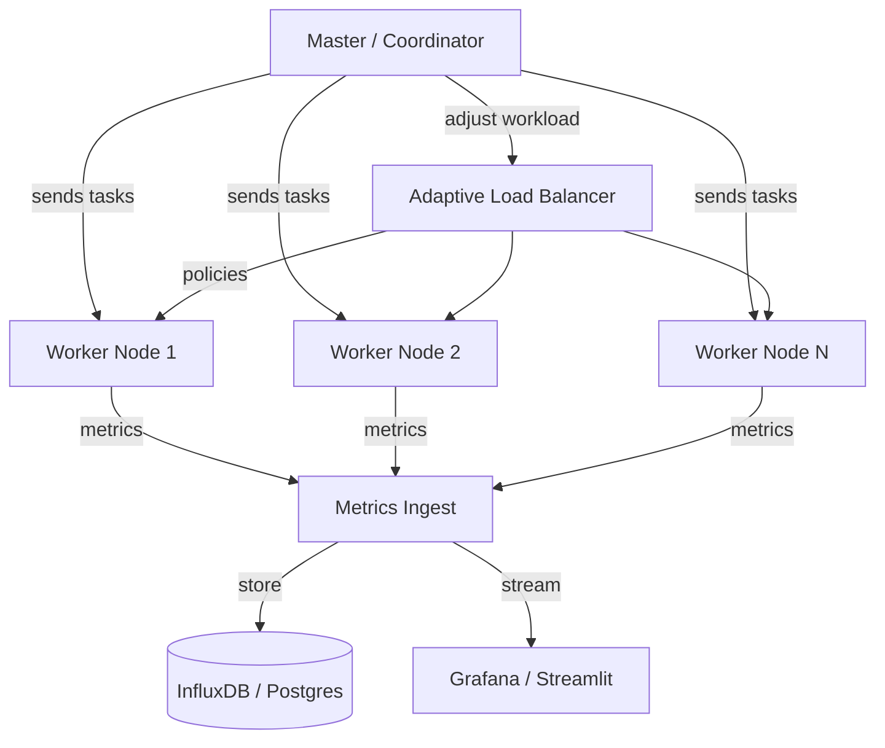
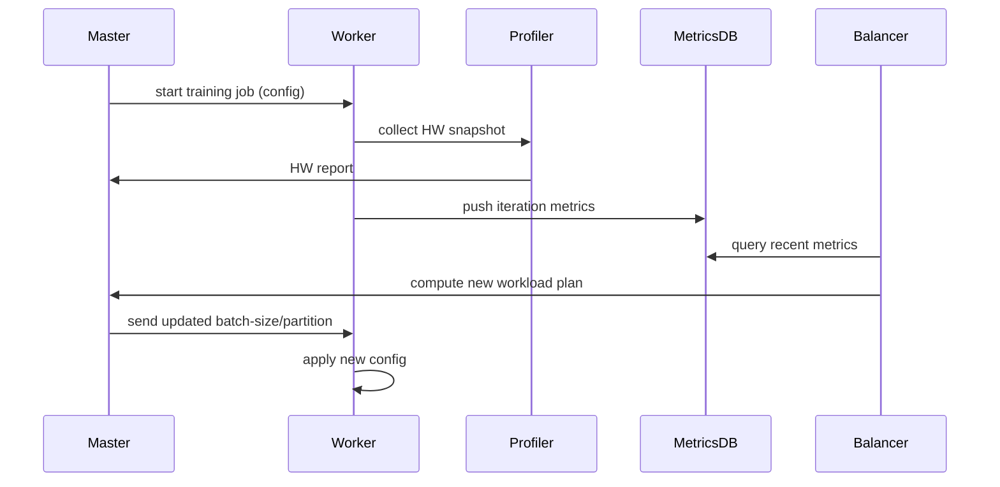
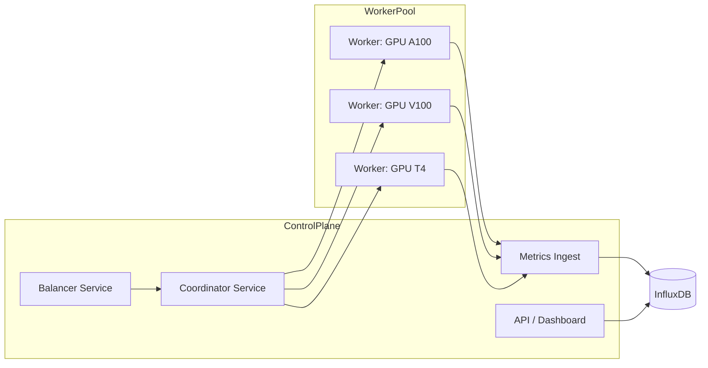

## Project: Heterogeneous Cluster Performance Profiler

**Short description**
A toolkit to profile, monitor, and adaptively balance distributed deep-learning training across heterogeneous clusters (mixed GPU/CPU generations and capacities). The system collects per-device metrics, analyzes bottlenecks, and adjusts workload distribution (batch sizes, model partitions) in real time.

**Goals**

* Accurate hardware discovery and benchmarking
* Real-time performance profiling and bottleneck analysis
* Adaptive load balancing to maximize throughput and reduce stragglers
* Visualization dashboard and experiment tracking

---

## Key Features

* Hardware discovery (GPU/CPU/Network/Storage)
* Per-iteration profiling (forward/backward/comm/data load)
* Adaptive load balancer (proportional batch sizing, dynamic partitioning)
* Real-time metrics pipeline (Prometheus/InfluxDB → Grafana/Streamlit)
* Fault-tolerance primitives and graceful degradation

---

## Tech Stack

**Languages & Frameworks**

* Python 3.9+
* PyTorch 2.x (primary)

**Distributed & Orchestration**

* Ray (recommended)
* torch.distributed (NCCL/Gloo)
* Horovod (optional)
* Docker, Kubernetes (optional)

**Profiling & Monitoring**

* NVIDIA NVML / DCGM
* PyTorch Profiler / CUDA events
* Prometheus (metrics), Grafana (dashboards)
* InfluxDB / PostgreSQL (historical store), Redis (cache)

**Frontend / Dashboards**

* Streamlit (fast prototype)
* React + Flask (production)
* Plotly.js (visuals)

**CI / Testing**

* pytest, unittest
* GitHub Actions for linting and basic integration tests

---

## Repo Layout (suggested)

```
/ (repo root)
├─ README.md
├─ docs/
│  ├─ architecture.md
│  └─ deployment.md
├─ src/
│  ├─ profiler/           # hardware + metrics collectors
│  ├─ trainer/            # distributed training abstractions
│  ├─ balancer/           # adaptive load balancer logic
│  ├─ monitor/            # metrics ingestion + exporters
│  └─ dashboard/          # streamlit / flask app
├─ tests/
├─ scripts/               # deployment scripts (docker, k8s, ray)
├─ experiments/           # notebooks + results
└─ docker-compose.yml
```

---

## Architecture Diagrams

### High-level overview



> Diagram notes: Master collects discovery and benchmarking data from workers. Workers run training and stream fine-grained metrics to the metrics ingestion service. The adaptive balancer consumes metrics and issues scheduling/batching updates to workers via the coordinator.

### Component-level interaction



> Sequence notes: iterative loop where each iteration’s metrics inform the next scheduling decision.

### Deployment topology (example)



---

## Getting Started (developer flow)

1. Clone repo and create virtual environment.
2. Install dependencies (`pip install -r requirements.txt`).
3. Start a simple metrics stack (InfluxDB + Grafana) locally via `docker-compose`.
4. Run unit tests for `profiler` and `trainer` modules.
5. Launch coordinator and two worker processes locally (simulate heterogeneous GPUs using device mocks if needed).
6. Run example training script and open dashboard.

---

## Configuration & Deployment

* Use environment variables for cluster config (RANK, WORLD_SIZE, MASTER_ADDR, MASTER_PORT).
* Provide a `nodes.yaml` that lists node capabilities for initial bootstrapping.
* Docker images: `profiler`, `worker`, `coordinator`, `dashboard`.
* Kubernetes: provide `Deployment` + `DaemonSet` for worker nodes and `StatefulSet` for metrics DB.

---

## Adaptive Load Balancer — Design Summary

**Inputs:** per-iteration metrics, historical performance, hw specs

**Outputs:** per-worker batch size, model partition mapping, priority/queueing hints

**Core algorithmic ideas:**

* Proportional batch sizing by compute/VRAM ratio
* Dynamic partition reassignment for model layers
* Straggler detection using EWMA of iteration times
* Optional asynchronous training with bounded staleness

---

## Experiments & Evaluation (recommended)

* Baselines: Standard DDP (uniform batch), static heterogeneous batching
* Metrics: Throughput (samples/sec), Wall-clock time per epoch, Load variance, Cost/epoch
* Test models: ResNet-50, BERT-base, small GPT (GPT-2 tiny) and datasets (ImageNet subset, GLUE)
* Ablations: mixed precision, gradient accumulation, communication compression

---

## Troubleshooting & Common Pitfalls

* CUDA OOM: detect and fallback to smaller per-device batch sizes
* Network saturation: limit inter-node transfers and overlap comm/compute
* Clock skew: ensure NTP sync across cluster for consistent timestamps
* Version mismatch: align CUDA, NCCL, PyTorch versions in Docker images

---

## Contributing

* Follow the repo contribution guidelines
* Run tests and document experiments in `experiments/`
* Use GitHub Actions for CI. Keep PRs scoped and include reproducible run scripts

---

## License

Choose an open-source license (MIT recommended for research prototypes).

---

## Appendix: Quick architecture checklist for `architecture.md`

* Full component diagrams (high-level, sequence, deployment)
* API endpoints (Coordinator → Worker, Metrics ingest API)
* Data model (metric schema) for time-series DB
* Failure modes and recovery flow
* Security considerations (RBAC, TLS for inter-node comms)

---

*End of document.*
