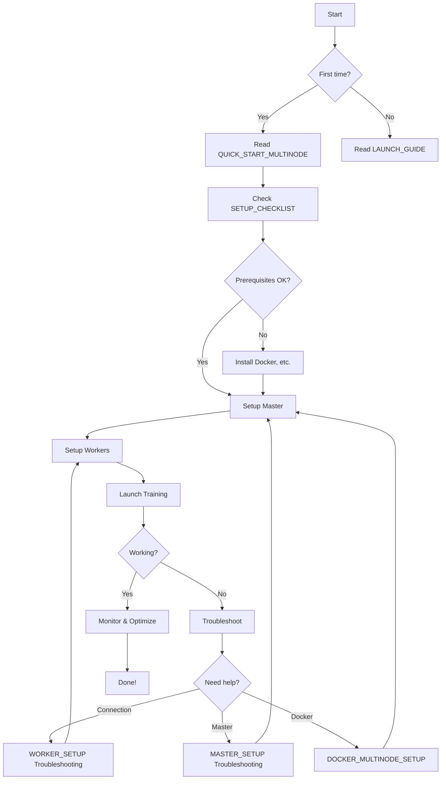

# Multi-Node Distributed Training - Documentation Index

Complete guide to setting up and running distributed training across multiple worker machines.

---

## 📚 Documentation Structure

### **Start Here:**

1. **[QUICK_START_MULTINODE.md](QUICK_START_MULTINODE.md)** ⚡
   - 5-minute quick start
   - Minimal setup, maximum speed
   - Best for: Getting started quickly

---

### **Detailed Setup Guides:**

2. **[SETUP_CHECKLIST.md](SETUP_CHECKLIST.md)** ✅
   - Prerequisites for all machines
   - Hardware requirements
   - Network configuration
   - Docker installation
   - Use before starting setup

3. **[MASTER_SETUP.md](MASTER_SETUP.md)** 🎯
   - Master node setup (RANK=0)
   - Three deployment methods:
     - Docker Hub (recommended)
     - Build locally
     - Save/load image
   - Troubleshooting master issues

4. **[WORKER_SETUP.md](WORKER_SETUP.md)** 🔧
   - Worker node setup (RANK 1, 2, 3...)
   - OS-specific instructions:
     - Linux workers
     - Windows workers
     - macOS workers
   - Connection troubleshooting

5. **[LAUNCH_GUIDE.md](LAUNCH_GUIDE.md)** 🚀
   - Complete training examples
   - Four real-world scenarios:
     - Hybrid GPU/CPU setup
     - All-GPU cluster
     - CPU-only cluster
     - Mixed Windows/Linux
   - Monitoring and dashboards
   - Performance tuning

---

### **Additional Resources:**

6. **[DOCKER_MULTINODE_SETUP.md](DOCKER_MULTINODE_SETUP.md)** 🐳
   - Comprehensive Docker guide
   - Advanced configurations
   - Security considerations
   - Private registry setup

7. **[README.md](README.md)** 📖
   - Project overview
   - Architecture diagrams
   - Features and tech stack

8. **[QUICKSTART.md](QUICKSTART.md)** ⚡
   - Single-machine quick start
   - Local testing

---

## 🗺️ Choose Your Path

### Path 1: Quick Start (Recommended)
**Time: ~10 minutes for 4 machines**

```
1. Read: QUICK_START_MULTINODE.md
2. Setup: Master + Workers
3. Done! Training starts automatically
```

**Best for:**
- First-time users
- Simple setups
- Quick testing

---

### Path 2: Detailed Setup
**Time: ~20 minutes for 4 machines**

```
1. Review: SETUP_CHECKLIST.md (verify prerequisites)
2. Follow: MASTER_SETUP.md (setup master)
3. Follow: WORKER_SETUP.md (setup each worker)
4. Launch: LAUNCH_GUIDE.md (start training)
```

**Best for:**
- Complex setups
- Troubleshooting issues
- Understanding details

---

### Path 3: Docker Expert Path
**Time: ~15 minutes**

```
1. Read: DOCKER_MULTINODE_SETUP.md
2. Setup custom Docker workflow
3. Deploy to cluster
```

**Best for:**
- Docker experts
- Custom configurations
- Production deployments

---

## 🎯 By Use Case

### I want to test on my laptops (2-4 machines)
→ **[QUICK_START_MULTINODE.md](QUICK_START_MULTINODE.md)**

### I have mixed GPU/CPU hardware
→ **[LAUNCH_GUIDE.md](LAUNCH_GUIDE.md)** (Scenario 1)

### I have all GPUs
→ **[LAUNCH_GUIDE.md](LAUNCH_GUIDE.md)** (Scenario 2)

### I have no GPUs (CPU-only)
→ **[LAUNCH_GUIDE.md](LAUNCH_GUIDE.md)** (Scenario 3)

### I have Windows + Linux machines
→ **[LAUNCH_GUIDE.md](LAUNCH_GUIDE.md)** (Scenario 4)

### I need to troubleshoot connection issues
→ **[WORKER_SETUP.md](WORKER_SETUP.md)** (Troubleshooting section)

### I want to use Docker Hub
→ **[MASTER_SETUP.md](MASTER_SETUP.md)** (Method A)

### I want offline deployment
→ **[MASTER_SETUP.md](MASTER_SETUP.md)** (Method C)

### I need to optimize performance
→ **[LAUNCH_GUIDE.md](LAUNCH_GUIDE.md)** (Performance Tips)

---

## 📊 Document Overview

| Document | Length | Difficulty | Purpose |
|----------|--------|------------|---------|
| QUICK_START_MULTINODE | 3 pages | ⭐ Easy | Fast setup |
| SETUP_CHECKLIST | 5 pages | ⭐ Easy | Prerequisites |
| MASTER_SETUP | 8 pages | ⭐⭐ Medium | Master setup |
| WORKER_SETUP | 10 pages | ⭐⭐ Medium | Worker setup |
| LAUNCH_GUIDE | 15 pages | ⭐⭐ Medium | Training examples |
| DOCKER_MULTINODE_SETUP | 20 pages | ⭐⭐⭐ Advanced | Docker details |

---

## 🔄 Typical Workflow



---

## 🎓 Learning Path

### Beginner (No prior distributed training experience)

1. Read project overview: **[README.md](README.md)**
2. Try single-machine: **[QUICKSTART.md](QUICKSTART.md)**
3. Multi-machine quick start: **[QUICK_START_MULTINODE.md](QUICK_START_MULTINODE.md)**
4. Understand details: **[LAUNCH_GUIDE.md](LAUNCH_GUIDE.md)**

### Intermediate (Some distributed training experience)

1. Review architecture: **[README.md](README.md)**
2. Setup cluster: **[MASTER_SETUP.md](MASTER_SETUP.md)** + **[WORKER_SETUP.md](WORKER_SETUP.md)**
3. Run examples: **[LAUNCH_GUIDE.md](LAUNCH_GUIDE.md)**
4. Optimize: Performance sections in guides

### Advanced (Distributed training expert)

1. Custom Docker setup: **[DOCKER_MULTINODE_SETUP.md](DOCKER_MULTINODE_SETUP.md)**
2. Modify training scripts: `src/training/`
3. Custom load balancing: `src/scheduling/`
4. Advanced profiling: `src/profiling/`

---

## 🔍 Quick Answers

### How many machines do I need?
**Minimum:** 2 (1 master + 1 worker)
**Recommended:** 3-4 for good heterogeneous testing
**Maximum:** Unlimited (tested up to 16)

### Do I need GPUs?
**No!** The system works with:
- All GPUs ✅
- Mixed GPU + CPU ✅
- All CPUs ✅

### What OSes are supported?
- Linux (Ubuntu, Debian, Fedora, etc.) ✅
- Windows 10/11 ✅
- macOS ✅
- Any OS with Docker ✅

### How long does setup take?
- **Quick start:** 5-10 minutes for 4 machines
- **Detailed setup:** 20-30 minutes for 4 machines
- **First-time setup:** 30-60 minutes (includes learning)

### Can I mix Windows and Linux?
**Yes!** Docker provides consistent environment across OSes.

### What if machines are on different networks?
Use VPN to connect them to same virtual network.

### Do all machines need the same hardware?
**No!** That's the point of heterogeneous training.
- Different GPU models ✅
- GPU + CPU mix ✅
- Different CPU speeds ✅

---

## 🐛 Troubleshooting Index

| Problem | Solution Location |
|---------|------------------|
| Workers can't connect | [WORKER_SETUP.md](WORKER_SETUP.md#troubleshooting) |
| Docker not found | [SETUP_CHECKLIST.md](SETUP_CHECKLIST.md#troubleshooting) |
| GPU not detected | [WORKER_SETUP.md](WORKER_SETUP.md#issue-gpu-not-detected) |
| Port already in use | [MASTER_SETUP.md](MASTER_SETUP.md#issue-address-already-in-use) |
| Out of memory | [LAUNCH_GUIDE.md](LAUNCH_GUIDE.md#issue-out-of-memory-on-one-rank) |
| Training hangs | [LAUNCH_GUIDE.md](LAUNCH_GUIDE.md#issue-training-hangs-at-initialization) |
| Firewall issues | [SETUP_CHECKLIST.md](SETUP_CHECKLIST.md#network-configuration) |

---

## 📈 Performance Optimization

See these sections:

1. **Load Balancing:**
   - [LAUNCH_GUIDE.md](LAUNCH_GUIDE.md#load-balancing-policies)

2. **Batch Size Tuning:**
   - [LAUNCH_GUIDE.md](LAUNCH_GUIDE.md#performance-tips)

3. **Communication Backends:**
   - [LAUNCH_GUIDE.md](LAUNCH_GUIDE.md#communication-backends)

4. **GPU Profiling:**
   - [DOCKER_MULTINODE_SETUP.md](DOCKER_MULTINODE_SETUP.md#custom-gpu-profiles)

---

## 🔒 Security

Production deployment security:

→ **[DOCKER_MULTINODE_SETUP.md](DOCKER_MULTINODE_SETUP.md#security-notes)**

Covers:
- Network security
- Firewall configuration
- VPN setup
- Data encryption

---

## 📞 Getting Help

1. **Check documentation:**
   - Use this index to find relevant section
   - Each guide has troubleshooting section

2. **Check logs:**
   ```bash
   docker logs hetero-master
   docker logs hetero-worker-1
   ```

3. **Verify setup:**
   - Review [SETUP_CHECKLIST.md](SETUP_CHECKLIST.md)
   - Test network connectivity
   - Check Docker status

4. **File an issue:**
   - Include logs
   - Describe setup (hardware, OS, network)
   - Steps to reproduce

---

## 🎯 Common Scenarios Quick Links

| Scenario | Guide | Section |
|----------|-------|---------|
| First-time setup | QUICK_START_MULTINODE | Full guide |
| 4 mixed machines | LAUNCH_GUIDE | Scenario 1 |
| All-GPU cluster | LAUNCH_GUIDE | Scenario 2 |
| Testing on CPUs | LAUNCH_GUIDE | Scenario 3 |
| Windows master | LAUNCH_GUIDE | Scenario 4 |
| Docker Hub deployment | MASTER_SETUP | Method A |
| Offline deployment | MASTER_SETUP | Method C |
| Connection issues | WORKER_SETUP | Troubleshooting |
| Performance tuning | LAUNCH_GUIDE | Performance Tips |

---

## 📁 File Organization

```
project/
├── MULTINODE_INDEX.md              ← You are here
├── QUICK_START_MULTINODE.md        ← Start here
├── SETUP_CHECKLIST.md              ← Prerequisites
├── MASTER_SETUP.md                 ← Master setup
├── WORKER_SETUP.md                 ← Worker setup
├── LAUNCH_GUIDE.md                 ← Training examples
├── DOCKER_MULTINODE_SETUP.md       ← Docker details
├── README.md                       ← Project overview
├── QUICKSTART.md                   ← Single-machine
│
├── scripts/
│   ├── docker_run_master_adaptive.sh    ← Master launcher
│   ├── docker_run_worker_adaptive.sh    ← Worker launcher (Linux)
│   └── docker_run_worker_adaptive.bat   ← Worker launcher (Windows)
│
├── src/
│   ├── training/         ← Training code
│   ├── profiling/        ← Hardware profiling
│   ├── scheduling/       ← Load balancing
│   └── monitoring/       ← Dashboard
│
└── experiments/          ← Results saved here
```

---

## ✅ Pre-Launch Checklist

Before starting training, verify:

- [ ] Read appropriate guide for your scenario
- [ ] All prerequisites met ([SETUP_CHECKLIST.md](SETUP_CHECKLIST.md))
- [ ] Docker installed on all machines
- [ ] Master and workers can ping each other
- [ ] Port 29500 open on master
- [ ] Unique RANK assigned to each worker
- [ ] Same WORLD_SIZE on all machines
- [ ] (Optional) GPU drivers installed on GPU machines

---

## 🎉 Quick Wins

**Fastest path to success:**

1. Start with 2 machines (1 master + 1 worker)
2. Use **[QUICK_START_MULTINODE.md](QUICK_START_MULTINODE.md)**
3. Test with small model (simple_cnn)
4. Add more workers after first success
5. Scale to larger models

---

## 📖 Additional Documentation

- **Architecture:** [README.md](README.md#architecture-diagrams)
- **Project Summary:** [PROJECT_SUMMARY.md](PROJECT_SUMMARY.md)
- **API Reference:** Code docstrings in `src/`
- **Results Analysis:** `scripts/analyze_results.py`

---

**Ready to start? → [QUICK_START_MULTINODE.md](QUICK_START_MULTINODE.md) 🚀**
